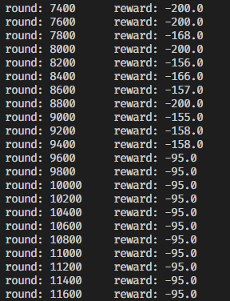
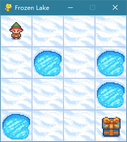

# 第一次作业

openai-gym: 使用 openai-gym 环境的代码 (Python3.7+gym0.25.2)

farama-gym: 使用 gym 环境的代码(Python3.10+gymnasium)

四选一
- [x] 复现 CartPole & MountainCar (env: openai-gym/gym)
- [x] 复现 CliffWalking 并调参查看效果 (env: openai-gym/gym)
- [x] 实现 CartPole | MountainCar 的强化学习算法 (**MountainCar** env:gym [code](./farama-gym/agent_car.py))
- [x] 选择 Gym 其他环境 完成强化学习算法 (**Taxi-v3** env:gym [code](farama-gym/taxi_v3.py) **FrozenLake-v1-RewardCustom** env:gym [code](farama-gym/FrozenLakeV2.py))

目前基于 `CliffWalking` 实现的算法 在一些类似的简单环境下可以通用
- `Acrobot-v1`
- `CartPole-v1` 需要针对`MountainCar`的类实现做初始化坐标映射的修改 下文有方案
- `Taxi-v3` 直接应用
- `FrozenLake-v1`
  - ~~我觉得是原本环境的reward有点问题 每一步有负分就好学一点~~
  - 对于修改奖励之后的环境 能够在30回合收敛

## CliffWalking

(openai-gym) 基于之前的QLearning.ipynb文件 重新整理代码 删去不需要的依赖 同时增加了最后的GUI展示代码

(gym) 使用`gymnasium`自带的"CliffWalking-v0"坏境(属于ToyText)

主要依赖公式 $Q[s,a] = r + \gamma Q[s', a']$ 进行参数更新

在`seed=42`的情况下 大概30个回合左右就能迭代到最优

## MountainCar QLearning

MountainCar-v0 环境
- observation-space 是两个维度的连续值 对该空间进行取样 做浮点坐标到整数坐标的映射
- action-space 离散值 如果该值是连续值 可以同上处理

[代码](farama-gym/agent_car.py)



上图为中间迭代输出 总的迭代回合数为15K 最后的reward为 -95

> 在`CartPole-v1`上表现不行 主要原因在于 这个环境的维度取值太小

```python
>>> gym.make("CartPole-v1").observation_space
Box([-4.8000002e+00 -3.4028235e+38 -4.1887903e-01 -3.4028235e+38], [4.8000002e+00 3.4028235e+38 4.1887903e-01 3.4028235e+38], (4,), float32)
```

可以的解决办法: 在类初始化计算 `unit` 时 同时对每个维度计算指数偏移 $log(1/unit)$ 之后再将偏移运算加入到坐标映射中

> 实现上述方法后可以完成 `Acrobot-v1` 环境的训练

## 自选环境

- [Taxi-v3](farama-gym/taxi_v3.py): 跟CliffWalking一样的逻辑
- [FrozenLake-v1](farama-gym/FrozenLakeV2.py): 指修改了奖励 逻辑同上


该环境测试图


该环境测试图

输出
```
round: 0         reward: -13.0
round: 29        reward: -1.0
4.0 # test reward
```

```
Reward schedule:
- Reach goal:   +1     ->   +10
- Reach hole:    0     ->   -10
- Reach frozen:  0     ->   -1
```