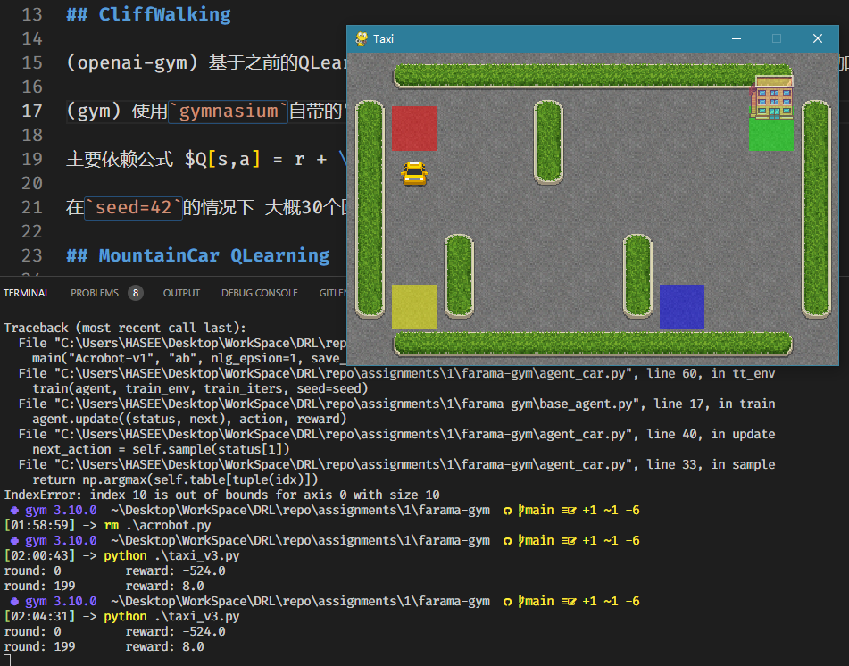

## 实验目的

1. 熟悉gym包
2. 了解QLearning算法
3. 在简单环境实践QLearning算法

## 实验环境

Linux Mint21/conda 23.1 

（已不更新） OpenAI gym `pip install gym==0.25.2 pygame==2.1.0`

（社区维护） Gymnasium `gymnasium gymnasium[classic_control]`

使用conda创建环境 见 env.yml/env.gym.yml

## 实验内容

完成了所有四个任务 代码在assignments中

openai-gym: 使用 openai-gym 环境的代码 (Python3.7+gym0.25.2)

farama-gym: 使用 gym 环境的代码(Python3.10+gymnasium)

- 复现 CartPole & MountainCar (两个环境)
- 复现 CliffWalking 并调参查看效果 (两个环境)
- 实现 CartPole | MountainCar 的强化学习算法 (**MountainCar** 代码 ./assignments/farama-gym/agent_car.py)
- 选择 Gym 其他环境 完成强化学习算法
  - **Taxi-v3** 代码 ./assignments/farama-gym/taxi_v3.py
  - **FrozenLake-v1-RewardCustom** 代码 ./assignments/farama-gym/FrozenLakeV2.py

所用的强化学习算法都是QLearning，更多详细内容见 assignments/README.md

## 结论(结果)

MountainCar的实验结果 对于MountainCar的离散状态空间进行采样 将每个维度映射到[0,100) 然后使用QTable存储奖励 最后在9500回合达到最好结果

使用 Taxi-v3 和 重置奖励的 FrozenLake 作为额外的环境

Taxi-v3 的测试图片

FrozenLakeV2 的测试图片

## 小结

QLearning 算法只适用于极其简单的低维状态空间环境和低维动作空间环境

对比状态空间和动作空间都非离散空间的环境 使用QLearning方法迭代慢同时维护的QTable巨大 消耗的内存很大

所以QLearning对于低维离散状态空间和动作空间环境效果很好 勉强能处理状态空间或者动作空间只有一个非离散的情况 对于状态空间和动作空间都非离散的情况 会导致QTable太大而迭代缓慢和消耗存储资源

